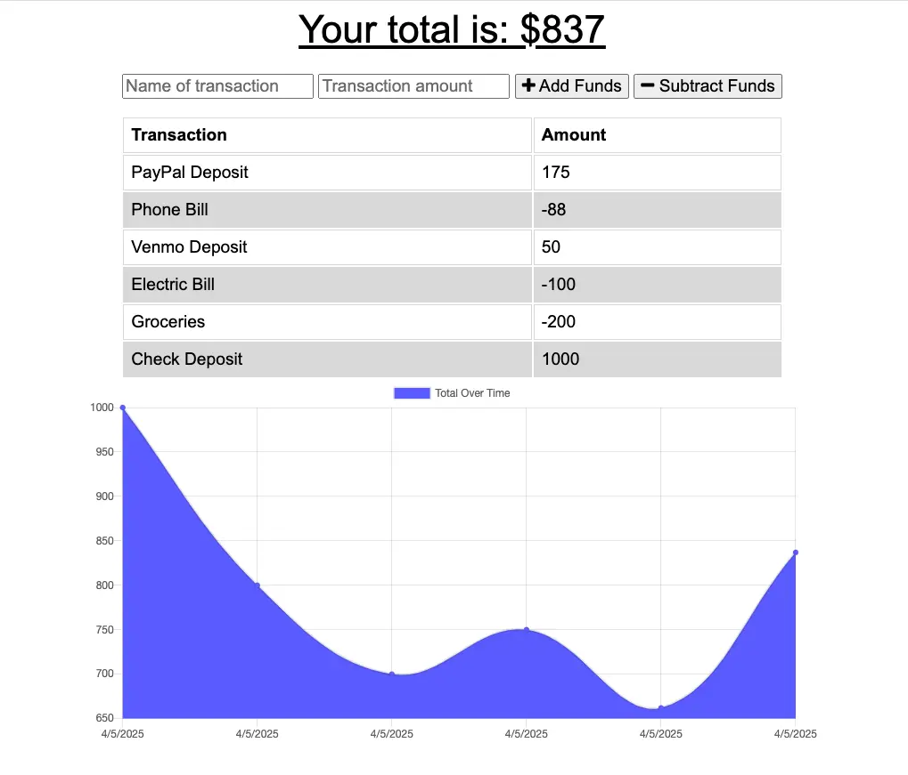

# Budget Tracker Application

## Overview
The Budget Tracker is a web application designed to help users manage their finances by tracking their transactions and visualizing their spending trends through a dynamic line graph. The application works both online and offline, ensuring that users can enter transactions even when they are not connected to the internet. Once online, all offline data will be synced to the backend server.

This project utilizes HTML5, CSS3, JavaScript, along with Mongoose for database management, Morgan for logging HTTP requests, and Compression for optimizing server responses

## Features
* Transaction Entry: Users can add daily or monthly transactions including amount, description, and category (e.g., "Food," "Entertainment").
* Offline Support: The app works offline by storing user transactions locally. Once the device reconnects to the internet, data is synced to the backend.
* Data Persistence: Local storage keeps transaction data available even when offline.
*Line Graph Visualization: Transactions are visually represented in a line graph, which updates as new transactions are entered.
* Backend API: A Node.js backend using Mongoose and Express handles data storage and synchronization when the app is online.
* Request Logging: The app logs HTTP requests using Morgan for easier debugging and monitoring.
* Response Compression: Server responses are compressed with Compression to improve performance and reduce bandwidth usage.

## Technologies Used
* Frontend:
    * HTML5
    * CSS3
    * JavaScript
    * Chart.js (for rendering line graph)
    * Service Workers (for offline functionality)
* Backend:
    * Node.js
    * Express
    * Mongoose (for database managment)
    * Morgan (for logging HTTP requests)
    * Compression (for optimizing response size)

### Prerequisites

* Node.js and npm installed on your machine.

### Installation

1. Clone the repository: 
    git clone https://github.com/caseofbase18/budget_tracker.git
2. Navigate into the project directory: 
    cd budget_tracker
3. Install dependencies: 
    npm install

## Usage

To start the app locally:
    npm run start

This will start the development server on http://localhost:3000

1. Add Transaction:
    * Click the "Add Transaction" button to open the transaction entry form.
    * Enter details such as the name of the transaction, the amount, and then click "+ Add Funds" or "- Subtract Funds".

2. View Graph:
    * After entering multiple transactions, view your spending trends with an interactive line graph. The graph is automatically updated as new transactions are added.

3. Offline Functionality:
    * If you are offline, the app will save your data locally.
    * When you’re back online, the app will sync any offline transactions with the server.

## Screenshot

